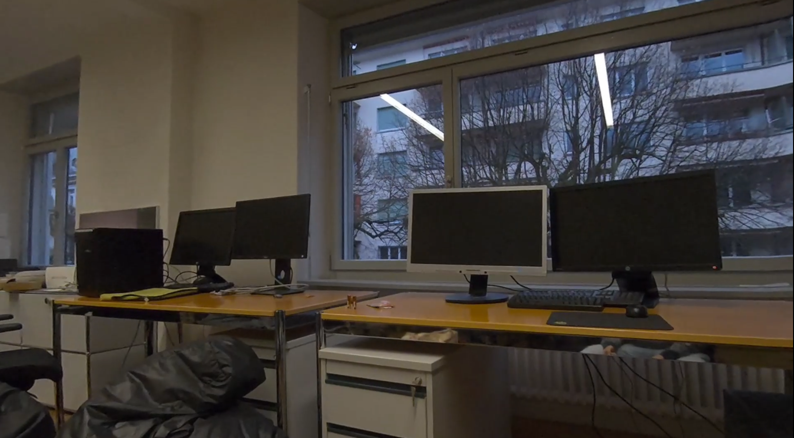
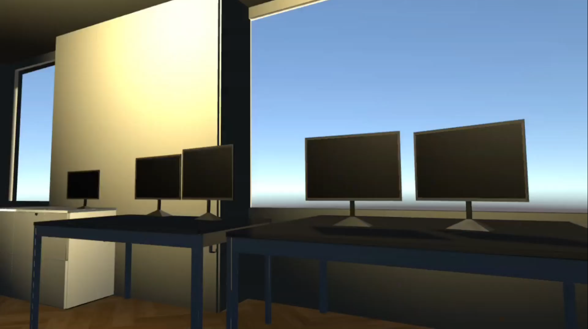

# Cross Reality App for Meta Quest 3

This project presents a Cross Reality (XR) application that combines Mixed Reality (MR) and Virtual Reality (VR) for simulating lighting in real-time. Users can design and visualize lighting by placing objects and light sources in an MR environment and viewing the effects in a virtual replica of the same space. The system uses automated room scanning and dynamic lighting, offering a tool that can be used for interior design and planning illumination of buildings. A user study highlighted its potential while suggesting improvements to the interface and functionality.

&nbsp;

## Authors

- Jeremy Bitar (bitarj@ethz.ch)
- Simon Ebner (ebners@ethz.ch)
- Laura Nydegger (nylaura@ethz.ch)

## Documents

- [Final Report](Deliverables/MR_Project_Report.pdf)

# Installation

## Operating System

Support for development varies between operating systems. Windows is fully supported by Meta, being the only one with a simulator. Mac appears to only lack the simulator. Linux is not supported at all, lacking native binaries for things such as MRUK (room scan)

## Prerequisites

- [Unity 2022.3.23f1](https://unity.com/download)

## Submodules

This repo uses a git submodule. Initialize/Update it with `git submodule update --init --recursive`

## Running the Unity Project

Open the project Unity Editor 2022.3.23f1. Restart the project if prompted to by OVRPlugin.

Once loaded, open the scene in `Assets/Scenes/Room Scan.unity`.

Press the play button with the headset connected to start the app. Alternativly deploy to the headset by switching to the Android platform (`File > Build Setting... > Android > Switch Platform`), followed by `Build` or `Build and Run` on the same window.

# Controls

| **Binding**			            | **Action**		        |
|-----------------------------------|---------------------------|
| Left Joystick	$\leftrightarrow$	| Rotate Objects            |
| Left Joystick	$\updownarrow$		| Scale Objects             |
| Right Joystick                    | Move Objects              |
| Right Trigger			            | Place Object              |
| X                                 | Switch between AR and VR  |
| Y                                 | Teleport					|